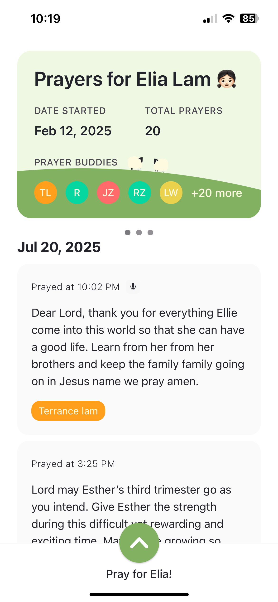
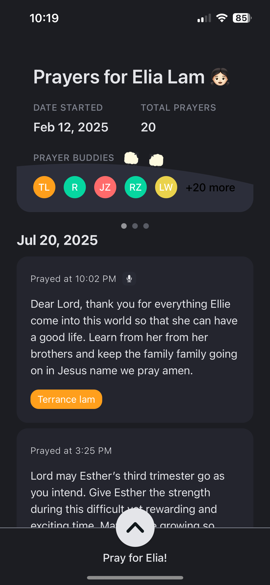
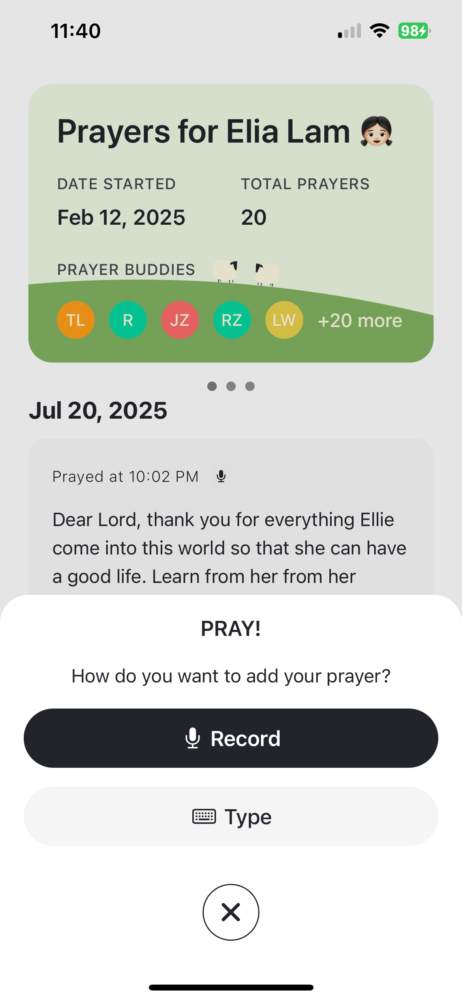
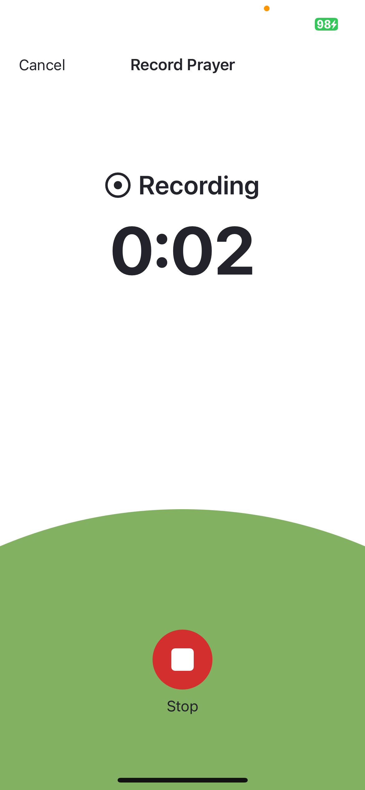

# Flock – Baby Shower Edition

**Special Edition:**  
This standalone version of **Flock** was created specifically for our baby shower — a space for friends and family to share prayers for our daughter **Elia** before she’s even born. You can leave a prayer through **voice or text**, and join us in covering her life in prayer from the very beginning.

**Note:** This is a one-off, forked version of the main Flock app and will not receive ongoing updates. It's here for showcase purposes and to celebrate this meaningful moment in our lives.

---

## Mission

To become a centralized hub for prayer, inspiring the act of prayer across the globe among both big and small communities.

---

## Key Features

- Leave a prayer for Elia via **voice recording** or **typed message**.
- View all prayers shared by others.
- No sign-in required — just tap, pray, and send.
- Smooth mobile experience optimized for TestFlight.

---

<p align="center">
  
  
</p>

<p align="center">
  <em>Left: Light mode · Right: Dark mode</em>
</p>

<p align="center">
  
  
</p>

<p align="center">
  <em>Left: Pray Modal · Right: Voice Recording </em>
</p>
---

## Project Structure & Setup

Built on **Expo** with native dependencies via `expo-dev-client`.

### Setup Instructions

1. Clone the repo
2. Navigate to project root (`Flock`)
3. Run setup script:

```bash
chmod +x setup.sh
./setup.sh
